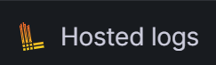
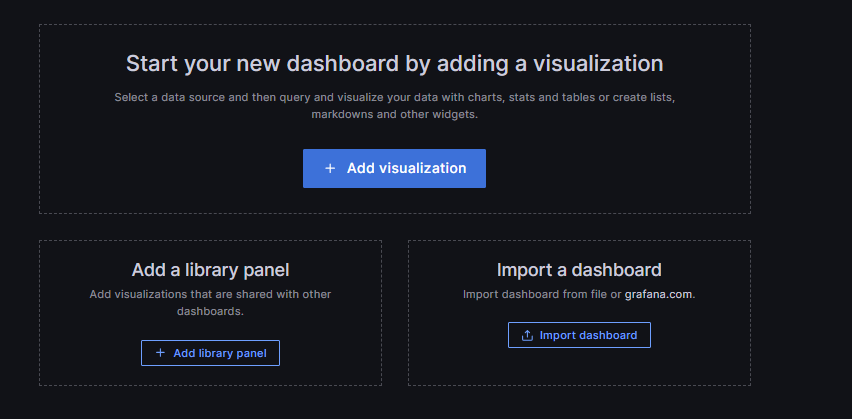
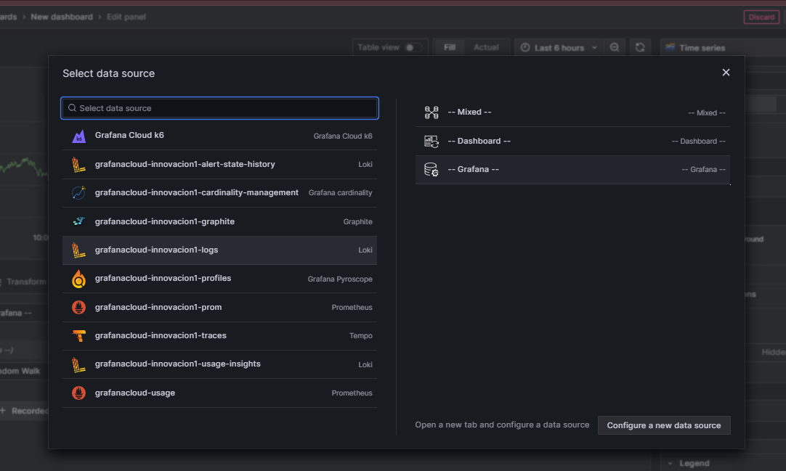
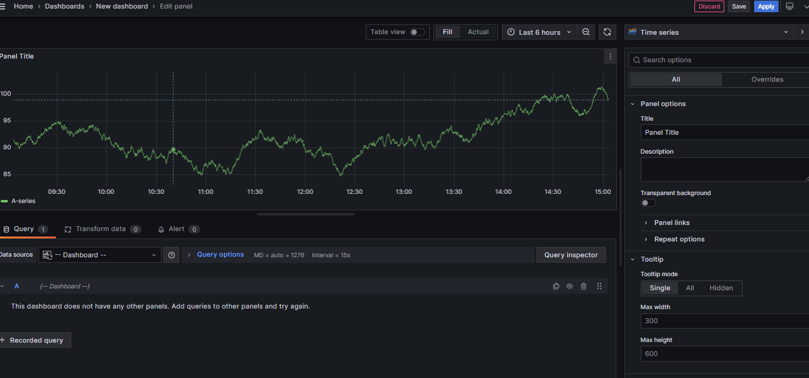
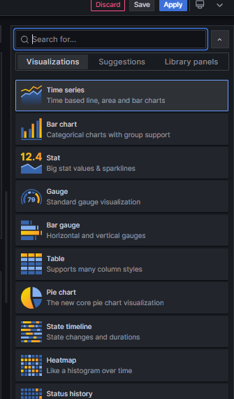
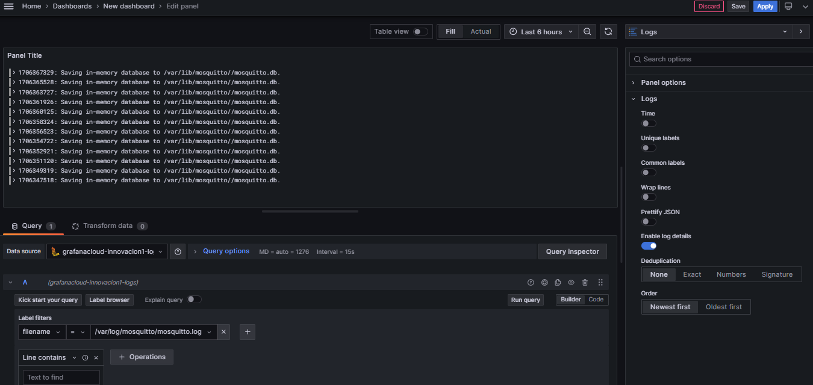
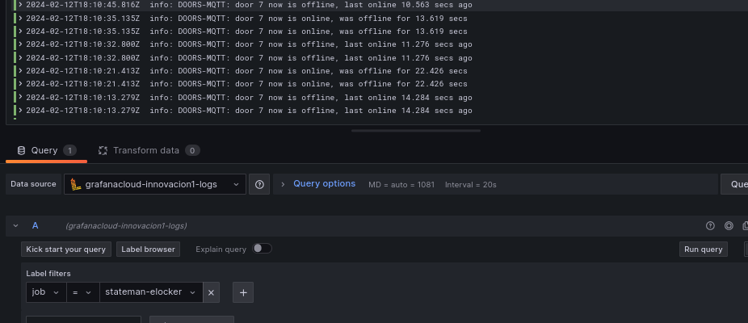

# Table of Contents

1.  [hosted logs](#org57975c8)
    1.  [config.yaml](#orgef17b23)
    2.  [arbol de directorio](#orgae22555)
    3.  [docker run](#org99e4573)
    4.  [Docker compose](#org5151cf2)
2.  [crear dashboard](#orgcc88694)

# hosted logs

nos dirigimos a Home -> Connections -> Add new connection -> Hosted logs

y creamos un token para el nuevos dispositivo nos dara una
configuracion agregando el token recien creado ejemplo:

## config.yaml

> [!WARNING]  
> Cada [dispositivo] tiene su propio token es recomendable sobreescribir la config de este repo
> usar esta config solo como base 

    
    server:
      http_listen_port: 0
      grpc_listen_port: 0
    
    positions:
      filename: /tmp/positions.yaml
    
    client:
      url: https://354058:glc_eyJvIjoiNzY4NDE4IiwibiI6InN0YWNrLTUwNDY5Ni1pbnRlZ3JhdGlvbi1hcnR1cml0byIsImsiOiIzY2ZNWjVoOHY0MjF2M3NaNTZxbjZQdWwiLCJtIjp7InIiOiJ1cyJ9fQ==@logs-prod-017.grafana.net/api/prom/push
    
    scrape_configs:
    - job_name: system   #es recomendable poner nombre asociado al dispositivo
      static_configs:
      - targets:
          - localhost
        labels:
          job: varlogs   #poner mismo nombre que job_name para reconocer en graphana
          __path__: /var/log/*.log

para agregar una nueva fuente de logs debe quedar asi

      server:
        http_listen_port: 0
        grpc_listen_port: 0
    
      positions:
        filename: /tmp/positions.yaml
    
      client:
        url: https://354058:glc_eyJvIjoiNzY4NDE4IiwibiI6InN0YWNrLTUwNDY5Ni1pbnRlZ3JhdGlvbi1hcnR1cml0byIsImsiOiIzY2ZNWjVoOHY0MjF2M3NaNTZxbjZQdWwiLCJtIjp7InIiOiJ1cyJ9fQ==@logs-prod-017.grafana.net/api/prom/push
    
      scrape_configs:
      - job_name: ar-locker #nombre de job (identificador en graphana)
        static_configs:
        - targets:
    	- localhost
          labels:
    	job: ar-locker
    	__path__: /var/log/*.log
    #comienzo de nueva fuente de logs
      - job_name: ar-mosquitto
        static_configs:
        - targets:
    	- localhost
          labels:
    	job: ar-mosquitto
    	__path__: /var/log/mosquitto 

## arbol de directorio

esta configuracion debe ir dentro de un directorio llamado promtail
es recomendable copiar desde la pagina de graphana ya que asi se copia el token del dispositivo
junto con los otros datos para recibir los logs en graphana

debe quedar algo asi:

    ├── docker-compose.yaml
    ├── promtail
    │       └── config.yaml

    /dir/promtail/config.yaml

siendo dir el directorio donde ejecutaremos el compose o comando de docker

## docker run

ejemplo de comando docker para ejecutar promtail con esta configuracion

    
    docker run --name promtail \
    --volume "$PWD/promtail:/etc/promtail" \ 
    --volume "/var/log:/var/log" \  #var antes de  { : } es la ruta desde donde tomaremos los logs
    grafana/promtail:main \
    -config.file=/etc/promtail/config.yaml

donde  &#x2013;volume "/var/log:/var/log"   el primer var log es la ruta donde provienen nuestros logs

ruta-local-logs:/var/log

    /home/dex/prod/logs:/var/logs  

cuidado con hacer esto

    /home/user/prod/logs/error.log:/var/log

esto no funciona y nos dara error ya qeu estamos tratando de montar un archivo en un direcctorio

## Docker compose

tambien es posible ejecutarlo desde docker compose que es la opcion mas recomendable
y reproducible (recordar que la config cambia token y hay qeu reemplazar por dispositivo)
en este caso seria asi:

    version: "3"
    
    networks:
      loki:
    
    services:
      promtail:
        image: grafana/promtail:2.9.0
        volumes:
          - /home/pi/prod/logs:/var/log            #la primera parte es desde donde vienen nuestros logs
          - /var/log/mosquitto/:/var/log/mosquitto #var log mosquitto fue definido en config.yaml
          - ./promtail/config.yaml:/etc/promtail/config.yml
    
        command: -config.file=/etc/promtail/config.yml
        networks:
          - loki

# crear dashboard

para crear un nuevo dasboard nos dirigimos a

[new dashboard](https://innovacion1.grafana.net/dashboard/new)

veremos esto

presionamos en add visualization y aparecera los siguiente

seleccionam el recolector de logs por defecto en este caso grafanacloud-innovacion1-logs y seleccionamos
dashboard, deberiamos ver algo asi:

donde dice time series seleccionamos que tipo de filtro requerimos en este caso
logs

una vez seleccionamoy ya tenemos seleccionado la fuente de logs
podemos seleccionar una query desde un archivo como el este ejemplo
que apunta al log de mosquitto

para buscar los logs de un dispositivo los seleccionaremos por job

